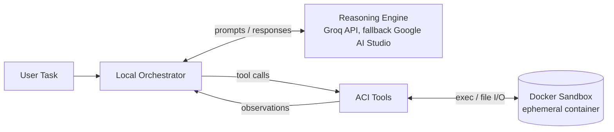

# Software Requirements Specification

## Autonomous Coding Agent

| | |
|---|---|
| **Document version** | 1.0 (Draft) |
| **Date** | 2026-10-04 |
| **Author** | Harsh |
| **Repository** | `harshmishra-1702/autonomous-coding-agent` |
| **Status** | In development |

---

## Table of Contents

1. [Introduction](#1-introduction)
2. [Overall Description](#2-overall-description)
3. [System Architecture](#3-system-architecture)
4. [Technology Stack](#4-technology-stack)
5. [Functional Requirements](#5-functional-requirements)
6. [Non-Functional Requirements](#6-non-functional-requirements)
7. [Constraints and Assumptions](#7-constraints-and-assumptions)
8. [Risks and Mitigations](#8-risks-and-mitigations)
9. [Acceptance Criteria](#9-acceptance-criteria)
10. [Development Roadmap](#10-development-roadmap)
11. [Glossary](#11-glossary)

---

## 1. Introduction

### 1.1 Purpose
This document specifies the requirements for an **Autonomous Coding Agent**: a system that accepts a high-level task in plain English, then writes, executes, tests, and debugs code on its own until the task is complete.

### 1.2 Scope
The agent operates through a continuous **ReAct (Reason + Act)** feedback loop. It uses a cloud-hosted LLM for reasoning and executes all generated code inside an isolated, ephemeral **Docker sandbox** on the local machine. The system runs at zero cost by relying on free-tier cloud inference.

**In scope:** ReAct orchestration, tool interface for the LLM, sandboxed execution, context management, CLI usage.
**Out of scope:** local LLM inference, web UI, multi-agent collaboration, long-term persistent memory across sessions.

### 1.3 Intended Audience
Developer (author), reviewers, and recruiters or contributors reading the repository.

---

## 2. Overall Description

### 2.1 Product Perspective
A standalone, locally run Python application. The only external dependency at runtime is the cloud LLM API.

### 2.2 Product Functions (summary)
- Interpret a natural-language engineering task
- Plan and choose actions iteratively (Reason, Act, Observe)
- Read and write files and run terminal commands through custom tools
- Execute all code safely in a sandbox
- Keep the LLM context within token limits

### 2.3 Hardware Constraints and Strategy
The host machine (Dell XPS 13 9370) has no dedicated GPU memory for local frontier-model inference. The system therefore follows a **Zero-Cost Architecture**: the host performs only CPU-bound orchestration and Docker management, while all LLM inference is offloaded to free-tier cloud APIs.

---

## 3. System Architecture

| Component | Responsibility |
|---|---|
| **Local Orchestrator** | Runs the ReAct loop, dispatches tool calls, manages sandbox lifecycle. Runs on the host. |
| **Execution Sandbox** | Isolated, ephemeral Docker container where code is compiled, run, and tested without risk to the host OS. |
| **Reasoning Engine (Cloud)** | Offloads LLM inference to cloud APIs for advanced reasoning without local hardware requirements. |

---

## 4. Technology Stack

| Component | Technology | Role |
|---|---|---|
| Hardware | Dell XPS 13 9370 | Host for local orchestration |
| Language | Python 3.11+ | Primary runtime |
| Containerization | Docker (Python Docker SDK) | Ephemeral execution sandbox |
| Orchestration | LangChain / LangGraph | ReAct loop and workflow management |
| LLM Inference | Groq API (fallback: Google AI Studio) | Cloud reasoning engine |
| Version Control | Git and GitHub | Source management and progress tracking |

---

## 5. Functional Requirements

| ID | Requirement | Priority |
|---|---|---|
| **FR-1** | **ReAct Loop.** The system shall implement a Reason-and-Act loop in which the LLM evaluates the task, selects a tool, observes the result, and repeats until it declares completion or a step limit is reached. | Must |
| **FR-2** | **Task Input.** The system shall accept a high-level English instruction through a command-line interface. | Must |
| **FR-3** | **Agent-Computer Interface (ACI).** The system shall provide custom tools designed for LLM consumption, with concise, structured outputs and clear error messages. Minimum set: `read_file`, `write_file`, `list_dir`, `run_command`. | Must |
| **FR-4** | **Secure Execution.** All agent-generated code and shell commands shall execute exclusively inside the isolated Docker sandbox, never on the host. | Must |
| **FR-5** | **Sandbox Lifecycle.** The system shall create a fresh container per task and destroy it on completion, failure, or interruption. | Must |
| **FR-6** | **Memory Management.** The system shall manage context-window limits by truncating or summarizing lengthy terminal outputs before returning them to the LLM. | Must |
| **FR-7** | **Self-Debugging.** On a failed command or test, the agent shall read the error output and attempt a corrective action. | Must |
| **FR-8** | **LLM Fallback.** If the primary provider (Groq) fails or is rate-limited, the system shall fall back to Google AI Studio. | Should |
| **FR-9** | **Run Logging.** The system shall record each Reason, Act, and Observation step for review and debugging. | Should |

---

## 6. Non-Functional Requirements

| ID | Category | Requirement |
|---|---|---|
| **NFR-1** | Security | The sandbox shall run with restricted resources (CPU, memory limits) and shall not mount host directories other than a dedicated workspace folder. |
| **NFR-2** | Security | Network access inside the sandbox shall be disabled by default and enabled only when explicitly configured. |
| **NFR-3** | Security | API keys shall be loaded from environment variables and never committed to version control. |
| **NFR-4** | Reliability | Every command execution shall enforce a timeout; the loop shall enforce a maximum step count. |
| **NFR-5** | Cost | The system shall operate using free-tier services only. |
| **NFR-6** | Performance | Orchestration overhead on the host shall remain CPU-light so the system runs on a GPU-less laptop. |
| **NFR-7** | Maintainability | Code shall be modular (LLM client, sandbox, tools, agent loop) with unit tests for tools and sandbox. |
| **NFR-8** | Portability | The system shall run on any host with Python 3.11+ and Docker installed. |

---

## 7. Constraints and Assumptions

**Constraints**
- No local GPU; inference must be remote.
- Free-tier API rate limits and context windows apply.
- Development effort is approximately one hour per day.

**Assumptions**
- Docker is installed and running on the host.
- A valid Groq API key (and optionally a Google AI Studio key) is available.
- The host has internet access for LLM calls.

---

## 8. Risks and Mitigations

| Risk | Impact | Mitigation |
|---|---|---|
| Free-tier rate limits | Agent stalls mid-task | Provider fallback (FR-8), retry with backoff |
| LLM loops without progress | Wasted tokens and time | Step limit and repeated-action detection (NFR-4) |
| Generated code damages host | Data loss | Sandbox isolation and restricted mounts (FR-4, NFR-1) |
| Large outputs overflow context | Failed LLM calls | Truncation and summarization (FR-6) |
| Docker unavailable or misconfigured | Agent cannot run | Startup health check with a clear error message |

---

## 9. Acceptance Criteria

The system is considered complete when, given an English task such as *"Write a Python CLI that prints FizzBuzz up to N, with tests, and make the tests pass"*, it:

1. Creates the required files in the sandbox workspace using ACI tools.
2. Runs the tests and detects at least one failure when present.
3. Fixes the failure autonomously and reaches a passing state.
4. Executes everything inside Docker, with no host-side code execution.
5. Terminates cleanly, destroys the container, and produces a step log.

---

## 10. Development Roadmap

| Milestone | Target | Deliverable |
|---|---|---|
| M1 Foundation | Days 1-2 | Repository, LLM call, Docker verified |
| M2 Sandbox | Days 3-5 | Sandbox class with start, exec, timeout, stop |
| M3 ACI Tools | Days 6-8 | File and command tools |
| M4 ReAct Loop | Days 9-12 | Working agent loop |
| M5 Memory | Days 13-14 | Output truncation and summarization |
| M6 LangGraph | Days 15-17 | Port to LangGraph, provider fallback |
| M7 Polish | Days 18-21 | CLI, demo task, documentation |

---

## 11. Glossary

| Term | Definition |
|---|---|
| **ReAct** | Reason + Act: an LLM pattern that alternates reasoning with tool use and observation. |
| **ACI** | Agent-Computer Interface: tools and output formats designed for an LLM rather than a human. |
| **Sandbox** | Isolated Docker container used to run untrusted, agent-generated code. |
| **Ephemeral** | Created for a single task and destroyed afterwards. |
| **Orchestrator** | Host-side program that coordinates the LLM, tools, and sandbox. |